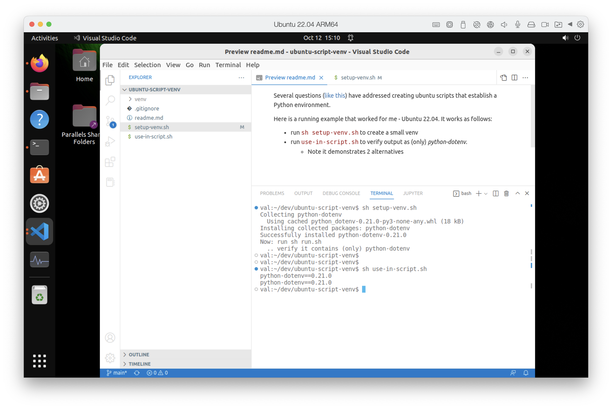

Several questions ([like this](https://stackoverflow.com/questions/14604699/how-to-activate-virtualenv-in-linux)) have addressed creating ubuntu scripts that establish a Python environment.

Here is a running example that worked for me - Ubuntu 22.04.  It works as follows:

* run `sh setup-venv.sh` to create a small venv
* run `use-in-script.sh` to verify output as (only) _python-dotenv_.
   * Note it demonstrates 2 alternatives

